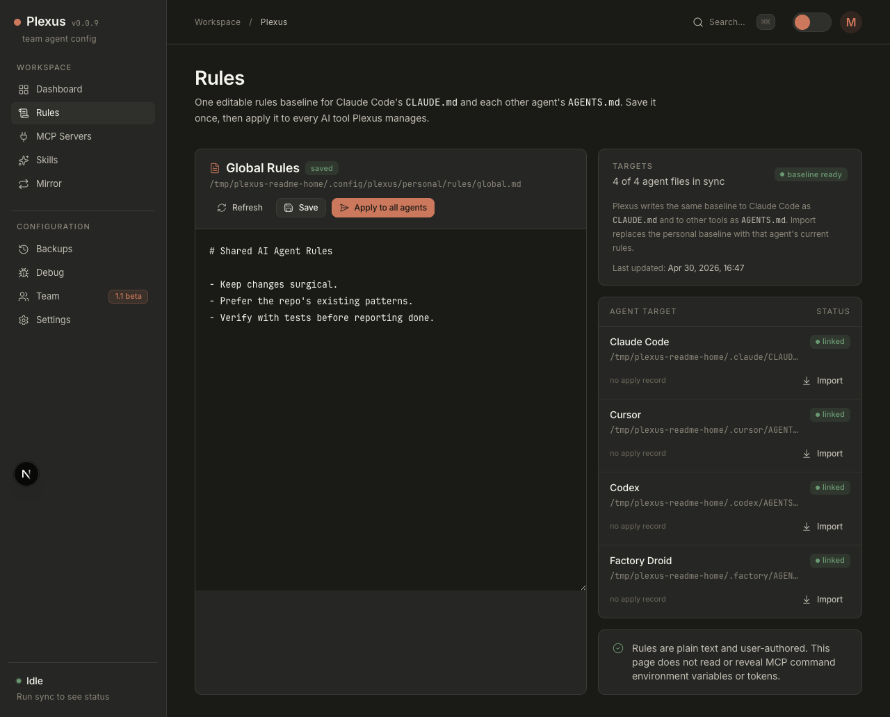
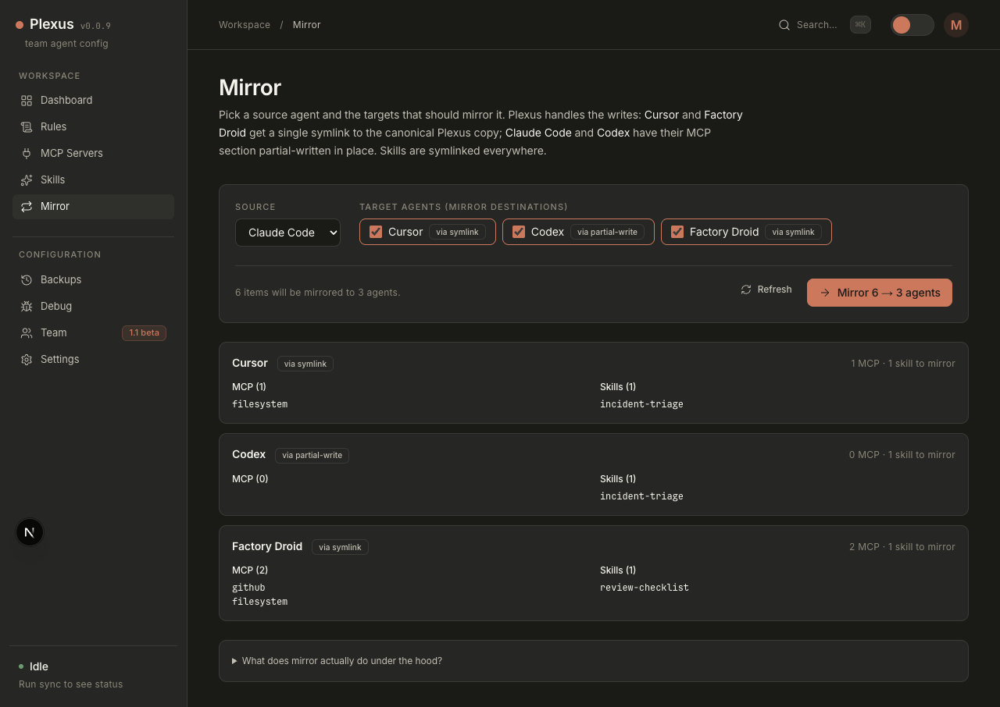

<p align="center">
  
</p>

<h1 align="center">Plexus</h1>

<p align="center">
  <strong>One local control plane for every AI coding agent.</strong>
</p>

<p align="center">
  Stop copying the same rules, MCP servers, and skills into Claude Code,
  Cursor, Codex, Gemini CLI, Qwen Code, and the rest by hand.
</p>

<p align="center">
  <a href="https://github.com/miniLV/Plexus/releases/latest">Latest Release</a> ·
  <a href="./README.md">简体中文</a> · <strong>English</strong>
</p>

<p align="center">
  <a href="https://github.com/miniLV/Plexus/actions/workflows/ci.yml">
    
  </a>
  <a href="https://github.com/miniLV/Plexus/releases">
    
  </a>
  <a href="./LICENSE">
    
  </a>
  
</p>

---

## Why Plexus?

Modern AI coding work is multi-agent. One person might use Claude Code for
planning, Cursor for editing, Codex for automation, then jump into Gemini CLI,
Qwen Code, Windsurf, or Kiro for specific workflows. Each tool has its own
config files, MCP format, skills folder, and instruction file.

That means every useful update turns into busywork:

- paste the same MCP server into multiple native config files
- keep `CLAUDE.md` and `AGENTS.md` in sync
- duplicate skills or prompts across agent-specific folders
- remember what changed when an agent breaks
- undo a bad sync without losing unrelated auth or history

Plexus gives those tools one local source of truth.

## What It Does

| Capability | What Plexus manages |
| --- | --- |
| Global Rules | One baseline in `~/.config/plexus/personal/rules/global.md`, projected to `CLAUDE.md` and `AGENTS.md` |
| MCP Servers | Team + personal MCP servers synced into each agent's native format |
| Skills | Markdown skill bundles linked or copied into each agent's skill directory |
| Mirror | Copy effective config from one agent to other agents with a preview |
| Backups | Snapshot native files before writes, then restore from the dashboard |
| Team Layer | Subscribe to a Git repo for team-approved MCPs and skills |

Plexus does not run your MCP servers. It is a local dashboard for safely
editing and projecting configuration.

## Screenshots

### One Dashboard For Every Agent

See detected agents, sync state, rules coverage, MCP counts, skills, and
recent backup activity in one place.

<p align="center">
  
</p>

### One Rules File, Applied Everywhere

Edit one shared baseline and apply it to Claude Code's `CLAUDE.md` plus each
other agent's `AGENTS.md`.

<p align="center">
  
</p>

### Mirror Config Between Agents

Pick a source agent, preview what each target is missing, then mirror the
needed MCP servers and skills.

<p align="center">
  
</p>

## Quick Start

Requires Node 20.

```bash
git clone https://github.com/miniLV/Plexus.git
cd Plexus
npm ci
npm run dev
```

Open [http://localhost:7777](http://localhost:7777).

On first run, click **Share config everywhere** in the dashboard:

1. Plexus imports MCP servers and skills already configured in your agents.
2. If multiple agents have different config, Plexus smart-merges it: unique IDs are preserved, and same-ID conflicts are resolved by the Primary Agent.
3. It enables those entries for every installed and enabled agent.
4. If a global Rules baseline exists, it applies it to each agent's `CLAUDE.md` / `AGENTS.md`; Rules conflicts use the same Primary Agent choice.
5. It syncs the native files and creates backups before writing.

For a linked local CLI:

```bash
npm run link
plexus
```

To remove the linked CLI:

```bash
npm run unlink
```

## Supported Agents

| Agent | Rules target | MCP target | Skills target | MCP write mode |
| --- | --- | --- | --- | --- |
| Claude Code | `~/.claude/CLAUDE.md` | `~/.claude.json` | `~/.claude/skills/` | partial write |
| Cursor | `~/.cursor/AGENTS.md` | `~/.cursor/mcp.json` | `~/.cursor/commands/` | symlink or copy |
| Codex | `~/.codex/AGENTS.md` | `~/.codex/config.toml` | `~/.codex/skills/` | partial write |
| Gemini CLI | `~/.gemini/GEMINI.md` | `~/.gemini/settings.json` | `~/.gemini/skills/` | partial write |
| Qwen Code | `~/.qwen/QWEN.md` | `~/.qwen/settings.json` | `~/.qwen/skills/` | partial write |
| Factory Droid | `~/.factory/AGENTS.md` | `~/.factory/mcp.json` | `~/.factory/skills/` | symlink or copy |

Partial write means Plexus rewrites only the MCP section and preserves the
agent-owned auth, history, profile, and settings data in the same file.

Settings also includes an Agent Catalog for common tools such as Windsurf,
Kiro, VS Code Copilot, Cline, Roo Code, Kilo Code, Continue, Aider, Amp,
OpenHands, and Zed AI. Tools without a native Plexus adapter are shown as
manual presets so users can register a custom instruction file quickly.

## How It Works

Plexus stores canonical config under `~/.config/plexus/`:

```text
~/.config/plexus/
├── config.yaml
├── team/
├── personal/
│   ├── mcp/servers.yaml
│   ├── rules/global.md
│   └── skills/<id>/SKILL.md
├── .cache/mcp/
└── backups/
```

The `team/` layer is intended to come from a shared Git repo. The `personal/`
layer belongs to the local user and overrides team entries with the same ID.

For single-purpose native MCP files such as Cursor and Factory Droid, Plexus
uses symlinks when possible. For shared native files such as `~/.claude.json`,
`~/.codex/config.toml`, `~/.gemini/settings.json`, and `~/.qwen/settings.json`,
Plexus partial-writes only the MCP section.

## CLI

```text
plexus              start the dashboard
plexus start -p 7777
plexus detect       list detected agents
plexus join <url>   clone a team config repo into ~/.config/plexus/team
plexus pull         pull the configured team repo
plexus sync         import, share, and apply config to all enabled agents
plexus sync --prefer codex
plexus status       show team subscription and sync status
plexus help
```

## Safety Model

- Plexus is local-first.
- Plexus does not execute MCP servers.
- Native files are snapshotted before writes.
- Debug snapshots return metadata only, not file contents.
- Imported MCP `env` values are stored as plaintext in the local personal
  store.
- Do not push `~/.config/plexus/personal/` to a shared team repo without
  reviewing and redacting secrets.

## Development

```bash
npm ci
npm run verify
```

Focused commands:

```bash
npm run check
npm run test:core
npm run build --workspace=@plexus/core
npm run build --workspace=@plexus/web
```

## Current Status

Plexus is alpha software. The local workflows are usable on macOS and Linux,
but there are still sharp edges:

- project-scoped MCP files are not managed yet
- dashboard PR proposals for team config are not built yet
- custom agents are instruction-file registry records only
- Rules apply currently targets built-in agents only
- Windows support is unverified

## License

[Apache-2.0](./LICENSE)
