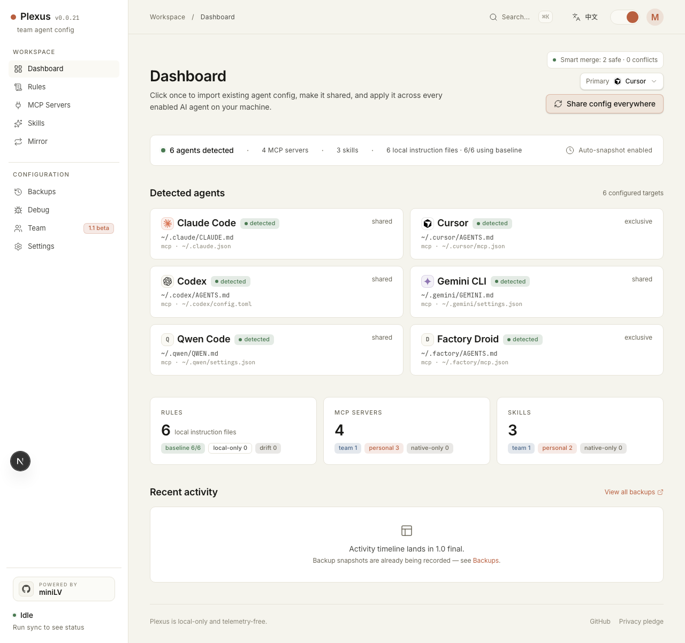
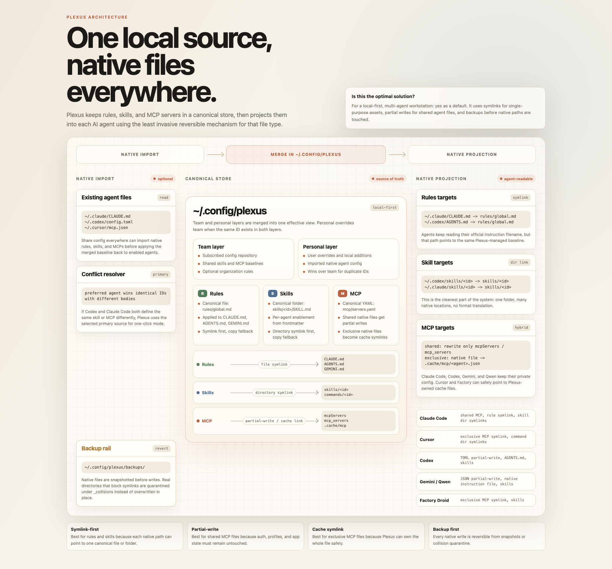

<h1 align="center">Plexus</h1>

<p align="center">
  <strong>One local dashboard for sharing rules, MCP servers, and skills across your AI coding tools.</strong>
</p>

<p align="center">
  Import what you already have in Claude Code, Cursor, Codex, Gemini CLI, Qwen Code, and then share it with the other agents on your machine.
</p>

<p align="center">
  <a href="https://github.com/miniLV/Plexus/releases/latest">Latest Release</a> ·
  <a href="./README.md">简体中文</a> · <strong>English</strong>
</p>

<p align="center">
  If Plexus saves you from maintaining the same agent config in five places,
  a GitHub star helps other multi-agent developers find it.
</p>

<p align="center">
  <a href="https://github.com/miniLV/Plexus/actions/workflows/ci.yml">
    
  </a>
  <a href="https://github.com/miniLV/Plexus/releases">
    
  </a>
  <a href="./LICENSE">
    
  </a>
  
</p>

<p align="center">
  
</p>

---

## Why Plexus?

Modern AI coding work is multi-agent. One person might use Claude Code for
planning, Cursor for editing, Codex for automation, then jump into Gemini CLI,
Qwen Code, Windsurf, or Kiro for specific workflows. Each tool has its own
config files, MCP format, skills folder, and instruction file.

That means every useful update turns into busywork:

- paste the same MCP server into multiple native config files
- keep `CLAUDE.md` and `AGENTS.md` in sync
- duplicate skills or prompts across agent-specific folders
- remember what changed when an agent breaks
- undo a bad sync without losing unrelated auth or history

Plexus gives those tools one local source of truth.

## 30-Second Pitch

Use Plexus if you run Claude Code plus Cursor, Codex, Gemini CLI, or Qwen Code and are tired of hand-editing the same config in five places.

Plexus imports what you already have, lets you choose a Primary Agent when configs conflict, stores a local baseline under `~/.config/plexus/`, then projects Rules, MCP servers, and Skills back into each agent's native location. Native files are snapshotted before writes, so you can undo from the Backups page.

## What It Does

| Capability | What Plexus manages |
| --- | --- |
| Global Rules | One baseline in `~/.config/plexus/personal/rules/global.md`, projected to `CLAUDE.md` and `AGENTS.md` |
| MCP Servers | Team + personal MCP servers synced into each agent's native format |
| Skills | Markdown skill bundles linked or copied into each agent's skill directory |
| Mirror | Copy effective config from one agent to other agents with a preview |
| Backups | Snapshot native files before writes, then restore from the dashboard |
| Team Layer | Subscribe to a Git repo for team-approved MCPs and skills |

Plexus does not run your MCP servers. It is a local dashboard for safely
editing and projecting configuration.

## The Sync Model In One Image

Plexus does not force every AI tool into one invented format. It keeps one
canonical config on the local machine, then chooses the safest projection
mechanism for each file type: symlinks for Rules and Skills, cache symlinks for
exclusive MCP files, and partial writes for shared native config files.

<p align="center">
  
</p>

You can open the same map from the local dashboard at
`/architecture/config-sharing-map.html`.

The manual entry point for new tools is **Settings -> Agent Catalog**. If an AI
agent is not built in yet, click **Add agent** to register its instruction file;
Plexus can view, edit, and back it up now, while MCP / Skills adapters can be
added later.

## Quick Start

Requires Node 20.

### Install from npm

```bash
npm install -g plexus-agent-config
plexus
```

Or run it once:

```bash
npx plexus-agent-config
```

Open [http://localhost:7777](http://localhost:7777).

### Run from source

```bash
git clone https://github.com/miniLV/Plexus.git
cd Plexus
npm ci
npm run dev
```

Open [http://localhost:7777](http://localhost:7777).

On first run, click **Share config everywhere** in the dashboard:

1. Plexus detects installed agents and imports existing Rules, MCP servers, and Skills.
2. It shows a smart-merge preview; same-ID conflicts use the selected Primary Agent.
3. It applies config to enabled agents and snapshots native files before writing.

For a linked local CLI:

```bash
npm run link
plexus
```

To remove the linked CLI:

```bash
npm run unlink
```

## Supported Agents

| Agent | Rules target | MCP target | Skills target | MCP write mode |
| --- | --- | --- | --- | --- |
| Claude Code | `~/.claude/CLAUDE.md` | `~/.claude.json` | `~/.claude/skills/` | partial write |
| Cursor | `~/.cursor/AGENTS.md` | `~/.cursor/mcp.json` | `~/.cursor/commands/` | symlink or copy |
| Codex | `~/.codex/AGENTS.md` | `~/.codex/config.toml` | `~/.codex/skills/` | partial write |
| Gemini CLI | `~/.gemini/GEMINI.md` | `~/.gemini/settings.json` | `~/.gemini/skills/` | partial write |
| Qwen Code | `~/.qwen/QWEN.md` | `~/.qwen/settings.json` | `~/.qwen/skills/` | partial write |
| Factory Droid | `~/.factory/AGENTS.md` | `~/.factory/mcp.json` | `~/.factory/skills/` | symlink or copy |

Partial write means Plexus rewrites only the MCP section and preserves the
agent-owned auth, history, profile, and settings data in the same file.

Settings also includes an Agent Catalog for common tools such as Windsurf,
Kiro, VS Code Copilot, Cline, Roo Code, Kilo Code, Continue, Aider, Amp,
OpenHands, and Zed AI. Tools without a native Plexus adapter are shown as
manual presets so users can register a custom instruction file quickly.

The manual entry point is **Settings -> Agent Catalog -> Add agent**. Use it when a new tool is not in the built-in list yet, or when your local path differs from the preset.

## How It Works

Plexus stores canonical config under `~/.config/plexus/`:

```text
~/.config/plexus/
├── config.yaml
├── team/
├── personal/
│   ├── mcp/servers.yaml
│   ├── rules/global.md
│   └── skills/<id>/SKILL.md
├── .cache/mcp/
└── backups/
```

The `team/` layer is intended to come from a shared Git repo. The `personal/`
layer belongs to the local user and overrides team entries with the same ID.

For single-purpose native MCP files such as Cursor and Factory Droid, Plexus
uses symlinks when possible. For shared native files such as `~/.claude.json`,
`~/.codex/config.toml`, `~/.gemini/settings.json`, and `~/.qwen/settings.json`,
Plexus partial-writes only the MCP section.

## Team Starter Repo

You can use [miniLV/agent-primer](https://github.com/miniLV/agent-primer) as a first team baseline. It includes:

- `rules/global.md`: shared agent behavior rules
- `skills/<id>/SKILL.md`: reusable team skills
- `mcp/servers.yaml`: team-approved MCP servers

```bash
plexus join https://github.com/miniLV/agent-primer.git
plexus pull
plexus sync
```

You can also do this from the dashboard: open **Team**, click **Use
agent-primer**, then click **Join**. If the repo is private, make sure your
local GitHub credential can access it, or use the SSH URL:
`git@github.com:miniLV/agent-primer.git`.

This clones `agent-primer` into `~/.config/plexus/team/`. Plexus then treats it
as the team layer and overlays your local `~/.config/plexus/personal/` layer:

```text
agent-primer repo
  rules/global.md        -> Plexus Team Rules
  skills/*/SKILL.md      -> Plexus Team Skills
  mcp/servers.yaml       -> Plexus Team MCP

local machine
  ~/.config/plexus/team/     # git clone of agent-primer
  ~/.config/plexus/personal/ # your overrides, secrets, local paths
```

Example: your team adds the `code-review` skill to `agent-primer`. Every member
runs `plexus pull && plexus sync`, and that skill is projected into Claude Code,
Cursor, Codex, and other enabled agents. The team can keep the `github` MCP as
an optional placeholder; each person enables it from the Plexus MCP page and
adds their own token in the personal layer.

Note: MCP servers that depend on personal tokens, local paths, or database
connection strings should stay as placeholders / optional entries in the team
repo, then be completed or overridden from the user's local
`~/.config/plexus/personal/` layer.

## CLI

```text
plexus              start the dashboard
plexus start -p 7777
plexus detect       list detected agents
plexus join <url>   clone a team config repo into ~/.config/plexus/team
plexus pull         pull the configured team repo
plexus sync         import, share, and apply config to all enabled agents
plexus sync --prefer codex
plexus status       show team subscription and sync status
plexus help
```

## Safety Model

- Plexus is local-first.
- Plexus does not execute MCP servers.
- Native files are snapshotted before writes.
- Shared native config files use partial writes: only the Plexus-managed MCP section changes.
- Dedicated MCP files use symlink/copy mode, with the previous file quarantined first.
- Debug snapshots return metadata only, not file contents.
- Imported MCP `env` values are stored as plaintext in the local personal
  store.
- Do not push `~/.config/plexus/personal/` to a shared team repo without
  reviewing and redacting secrets.

## Development

```bash
npm ci
npm run verify
```

Focused commands:

```bash
npm run check
npm run test:core
npm run build --workspace=plexus-agent-config-core
npm run build --workspace=plexus-agent-config-web
```

## Current Status

Plexus is alpha software. The local workflows are usable on macOS and Linux,
but there are still sharp edges:

- project-scoped MCP files are not managed yet
- dashboard PR proposals for team config are not built yet
- custom agents are instruction-file registry records only
- Rules apply currently targets built-in agents only
- Windows support is unverified

## License

[Apache-2.0](./LICENSE)
