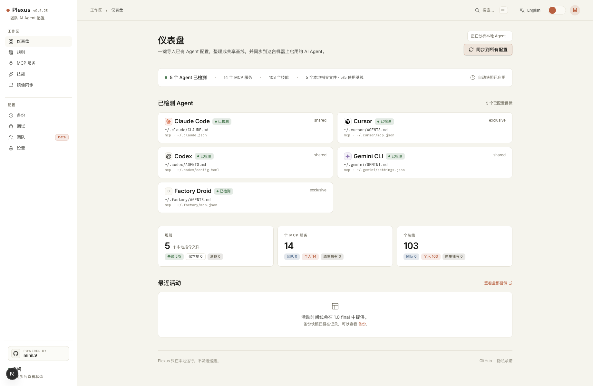

<h1 align="center">Plexus</h1>

<p align="center">
  <strong>一个本地控制台，把 Rules、MCP Servers 和 Skills 同步到你常用的 AI 编程工具。</strong>
</p>

<p align="center">
  先导入你已经配置好的 Claude Code、Cursor、Codex、Gemini CLI、Qwen Code 等工具，再用一次点击同步到其他 Agent。
</p>

<p align="center">
  <a href="https://github.com/miniLV/Plexus/releases/latest">Latest Release</a> ·
  <strong>简体中文</strong> · <a href="./README.en.md">English</a>
</p>

<p align="center">
  如果 Plexus 帮你少维护几份重复的 Agent 配置，欢迎点个 Star，让更多多 Agent 用户看到它。
</p>

<p align="center">
  <a href="https://github.com/miniLV/Plexus/actions/workflows/ci.yml">
    
  </a>
  <a href="https://github.com/miniLV/Plexus/releases">
    
  </a>
  <a href="./LICENSE">
    
  </a>
  
</p>

<p align="center">
  
</p>

---

## 为什么需要 Plexus？

现在的 AI 编程工作很少只用一个工具。你可能用 Claude Code 做规划，用 Cursor 写代码，用 Codex 跑自动化，再偶尔切到 Gemini CLI、Qwen Code、Windsurf 或 Kiro。问题是，每个工具都有自己的配置文件、MCP 格式、Skill 目录和指令文件。

于是每次有一个好用配置，都要重复做几遍：

- 把同一个 MCP Server 复制到多个 agent 的原生配置里
- 让 `CLAUDE.md` 和 `AGENTS.md` 保持一致
- 在不同工具的 skill / prompt 目录里维护相似文件夹
- 出问题后很难知道到底改了哪里
- 想回滚一次同步，又担心覆盖掉 auth、history 或个人设置

Plexus 的目标很简单：给这些工具一个本地的 single source of truth。

## 30 秒看懂

如果你同时使用 Claude Code、Cursor、Codex、Gemini CLI 或 Qwen Code，并且已经厌倦了在五六个地方手动维护同一份配置，Plexus 就是为这个场景做的。

它会先扫描你本机已有的配置，遇到多个来源时让你选择一个 Primary Agent，随后把 Rules、MCP Servers 和 Skills 写入 `~/.config/plexus/` 作为本地基线，再投射回每个 Agent 的原生位置。每次写入原生文件前都会创建 snapshot，后悔了可以从 Backups 页面恢复。

## Plexus 能做什么？

| 能力 | Plexus 管什么 |
| --- | --- |
| 全局规则 | 在 `~/.config/plexus/personal/rules/global.md` 维护一份基线，投射到 `CLAUDE.md` 和 `AGENTS.md` |
| MCP Servers | 把团队层和个人层的 MCP 同步到每个 agent 的原生格式 |
| Skills | 把 Markdown skill bundle 链接或复制到各 agent 的 skill 目录 |
| Mirror | 从一个 agent 选择有效配置，预览差异后同步到其他 agent |
| Backups | 每次写入原生文件前自动 snapshot，并支持从 dashboard 恢复 |
| Team Layer | 订阅一个 Git repo，分发团队认可的 MCP 和 skills |

Plexus 不运行 MCP Server。它只是一个本地 dashboard，用来安全地编辑、同步和回滚配置。

## 一张图看懂同步模型

Plexus 不要求所有 AI 工具改成同一种格式。它只在本机维护一份 canonical config，然后按文件类型选择最合适的投射方式：Rules 和 Skills 优先软链接，MCP 对专用文件使用 cache symlink，对共享文件使用 partial-write。

<p align="center">
  
</p>

这张图也可以在本地 dashboard 里打开：`/architecture/config-sharing-map.html`。

Agent Catalog 和手动新增入口在 **Settings -> Agent Catalog**。如果一个新工具还不在内置列表里，可以点 **Add agent** 先登记它的 instruction file；Plexus 会负责查看、编辑和备份，后续再逐步补齐 MCP / Skills adapter。

## 快速开始

需要 Node 20。

### 从这个 repo 试用

```bash
git clone https://github.com/miniLV/Plexus.git
cd Plexus
npm ci
npm run dev
```

打开 [http://localhost:7777](http://localhost:7777)。

第一次使用时，只需要点 Dashboard 右上角的 **Share config everywhere**：

1. Plexus 会检测已安装的 Agent，并导入它们已有的 Rules、MCP Servers 和 Skills。
2. 页面会展示 smart-merge preview；同 ID 冲突才使用你选择的 Primary Agent。
3. Plexus 会把配置应用到 enabled agents，并在写入原生文件前创建 snapshot。

如果想用本地 CLI：

```bash
npm run link
plexus
```

移除本地链接：

```bash
npm run unlink
```

## 支持的 Agent

| Agent | Rules 目标 | MCP 目标 | Skills 目标 | MCP 写入方式 |
| --- | --- | --- | --- | --- |
| Claude Code | `~/.claude/CLAUDE.md` | `~/.claude.json` | `~/.claude/skills/` | partial write |
| Cursor | `~/.cursor/AGENTS.md` | `~/.cursor/mcp.json` | `~/.cursor/commands/` | symlink or copy |
| Codex | `~/.codex/AGENTS.md` | `~/.codex/config.toml` | `~/.codex/skills/` | partial write |
| Gemini CLI | `~/.gemini/GEMINI.md` | `~/.gemini/settings.json` | `~/.gemini/skills/` | partial write |
| Qwen Code | `~/.qwen/QWEN.md` | `~/.qwen/settings.json` | `~/.qwen/skills/` | partial write |
| Factory Droid | `~/.factory/AGENTS.md` | `~/.factory/mcp.json` | `~/.factory/skills/` | symlink or copy |

Partial write 表示 Plexus 只重写 MCP section，保留同一个文件里由 agent 自己管理的 auth、history、profile 和 settings。

Settings 里还有 Agent Catalog，会列出 Windsurf、Kiro、VS Code Copilot、Cline、Roo Code、Kilo Code、Continue、Aider、Amp、OpenHands、Zed AI 等常见工具。没有 native adapter 的工具会作为 manual preset 展示，用户可以一键把它们注册成 custom agent 来追踪 instruction file。

手动新增入口在 **Settings -> Agent Catalog -> Add agent**。这适合新工具还没出现在内置列表、或者你的工具路径和预设不同的情况。

## 工作原理

Plexus 把 canonical config 放在 `~/.config/plexus/`：

```text
~/.config/plexus/
├── config.yaml
├── team/
├── personal/
│   ├── mcp/servers.yaml
│   ├── rules/global.md
│   └── skills/<id>/SKILL.md
├── .cache/mcp/
└── backups/
```

`team/` 层设计为来自共享 Git repo。`personal/` 层属于本机用户，并且会覆盖同 ID 的 team entry。

对于 Cursor、Factory Droid 这类单用途 MCP 文件，Plexus 会优先使用 symlink。对于 `~/.claude.json`、`~/.codex/config.toml`、`~/.gemini/settings.json` 和 `~/.qwen/settings.json` 这种共享原生文件，Plexus 只 partial-write MCP section。

## Team Starter Repo

可以直接用 [miniLV/agent-primer](https://github.com/miniLV/agent-primer) 作为第一份团队基线。它包含：

- `rules/global.md`：共享的 agent 行为准则
- `skills/<id>/SKILL.md`：团队可复用 skills
- `mcp/servers.yaml`：团队认可的 MCP servers

```bash
plexus join https://github.com/miniLV/agent-primer.git
plexus pull
plexus sync
```

也可以在 dashboard 里操作：打开 **Team**，点击 **使用 agent-primer**，再点击 **加入**。如果这个 repo 是 private，确保本机 GitHub credential 可用，或者改用 SSH URL：`git@github.com:miniLV/agent-primer.git`。

这条命令会把 `agent-primer` clone 到 `~/.config/plexus/team/`。之后 Plexus 会把它当作 team layer，再叠加你本机的 `~/.config/plexus/personal/`：

```text
agent-primer repo
  rules/global.md        -> Plexus Team Rules
  skills/*/SKILL.md      -> Plexus Team Skills
  mcp/servers.yaml       -> Plexus Team MCP

local machine
  ~/.config/plexus/team/     # git clone of agent-primer
  ~/.config/plexus/personal/ # your overrides, secrets, local paths
```

举个例子：团队把 `code-review` skill 加进 `agent-primer`，所有成员只需要执行 `plexus pull && plexus sync`，这个 skill 就会进入 Claude Code、Cursor、Codex 等已启用 agent 的 skill 目录。团队把 `github` MCP 留成 optional placeholder；个人需要时，在 Plexus 的 MCP 页面启用它，并在 personal layer 里补自己的 token。

注意：team repo 里的 MCP 如果依赖个人 token、本机路径或数据库连接，应该先保持 placeholder / optional，再由个人在 `~/.config/plexus/personal/` 里覆盖或补全。

## CLI

```text
plexus              start the dashboard
plexus start -p 7777
plexus detect       list detected agents
plexus join <url>   clone a team config repo into ~/.config/plexus/team
plexus pull         pull the configured team repo
plexus sync         import, share, and apply config to all enabled agents
plexus sync --prefer codex
plexus status       show team subscription and sync status
plexus help
```

## 安全模型

- Plexus 是 local-first。
- Plexus 不执行 MCP Server。
- 每次写入 agent 原生文件前都会创建 snapshot。
- 共享配置文件采用 partial-write，只改 Plexus 管理的 MCP section。
- 专用 MCP 文件优先使用 symlink/copy，写入前会 quarantine 原文件。
- Debug snapshots 只返回 metadata，不返回文件内容。
- 导入的 MCP `env` 会以明文存在本地 personal store。
- 不要在没有审查和脱敏的情况下，把 `~/.config/plexus/personal/` 推到团队 repo。

## 开发

```bash
npm ci
npm run verify
```

常用命令：

```bash
npm run check
npm run test:core
npm run build --workspace=@plexus/core
npm run build --workspace=@plexus/web
```

## 当前状态

Plexus 仍处于 alpha 阶段。本地工作流已经可以在 macOS 和 Linux 上使用，但仍有一些限制：

- 暂不管理 project-scoped MCP 文件
- Dashboard 里的 team config PR proposal 还没做
- Custom agents 目前只是 instruction-file registry records
- Rules apply 当前只覆盖内置 agents
- Windows 支持还未验证

## License

[Apache-2.0](./LICENSE)
