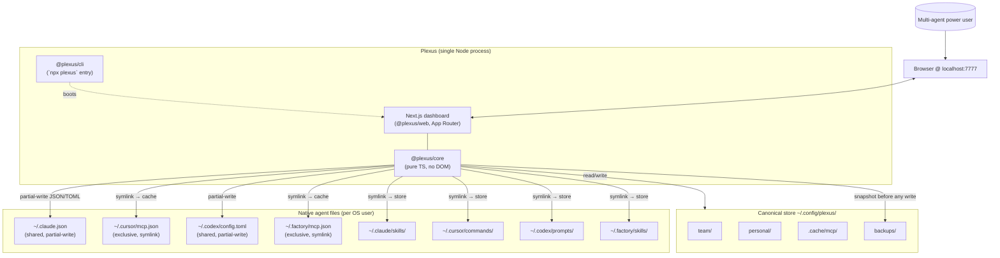
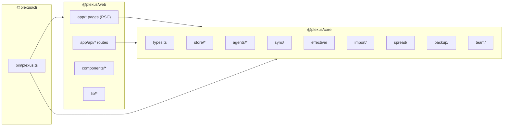
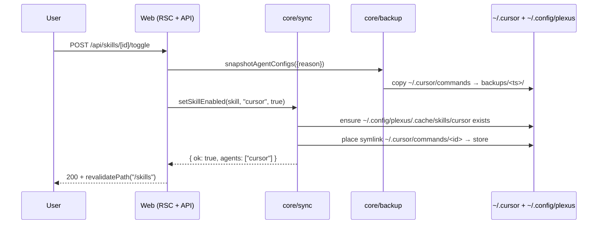
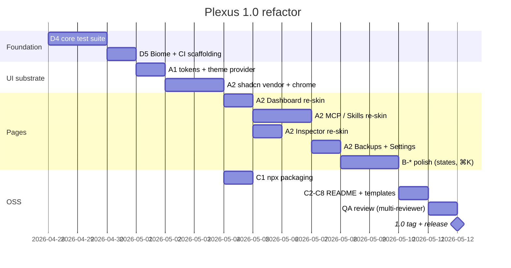

# Plexus 1.0 — Architecture Spec & ADRs

> **Phase:** Architect
> **Owner:** Plexus team
> **Status:** Draft v1 — paired with `01-prd.md` and `02-design.md`
> **Source skill:** `architecture-designer`

This document records the architectural decisions for the 1.0 refactor.
The product's core hybrid-sync contract (CLAUDE.md §3.2) is **frozen**;
ADRs 0-2 codify it so every contributor can reason about what is and is
not negotiable. ADRs 3-10 are new decisions made for 1.0.

---

## 1. System Architecture

### 1.1 High-level



Key invariant: every arrow that touches a native path goes through the
backup module first (CLAUDE.md §4.3).

### 1.2 Process model

Plexus runs as **one Node process** that hosts the Next.js server and
the core library in the same V8 isolate. There is no socket server, no
background daemon, no IPC. This is intentional — a single process keeps
the trust surface small and makes "kill it and the agents stop being
modified" trivially true.

`npx plexus` boots this process from a packaged `next start` build; the
CLI subcommands (`detect`, `sync`, `status`) call into the same `core`
module directly without going through HTTP.

### 1.3 Module boundaries



`core` has **zero** browser dependencies, **zero** Next.js dependencies,
and **zero** React. It can be unit-tested with plain `vitest` in Node.
`apps/web` is the only thing that imports React. `cli` only imports
`core` and the packaged Next.js build entry.

### 1.4 Request flow (toggle a skill on Cursor)



Failure path (write rejected): backup is preserved, store mutation is
rolled back via `restoreSnapshot`, response carries error code +
remediation message.

---

## 2. Architecture Decision Records

ADRs are numbered, append-only, and live in this file. Once accepted, an
ADR is changed only via a new ADR that supersedes it.

---

### ADR-001 — Hybrid sync: exclusive (symlink) vs shared (partial-write)

**Status:** Accepted (frozen — inherited from prototype, restated for 1.0).

**Context.** Different agent files carry different amounts of state Plexus
must not own. `~/.claude.json` and `~/.codex/config.toml` hold auth,
history, and profile data; `~/.cursor/mcp.json` and `~/.factory/mcp.json`
hold MCP servers only.

**Decision.** Per agent we declare a `mcpFileMode: "exclusive" | "shared"`
in `core/store/paths.ts`. Exclusive files become symlinks to a Plexus
cache file; shared files are read, the `mcpServers` (or `mcp_servers`)
key is replaced in place, and the file is written back.

**Alternatives considered.**
- **All-shared (always partial-write).** Loses the benefit that a Cursor
  config edit immediately reflects in the store via the symlink.
- **All-exclusive (always own the file).** Would corrupt
  `~/.claude.json` auth on first sync. Non-starter.

**Consequences.**
- Positive: respects each agent's file ownership; minimal blast radius.
- Negative: every adapter must hold both code paths; tests must cover both.

**Trade-offs.** Operational complexity in code (two write strategies)
vs operational safety in production (no auth corruption). Safety wins.

---

### ADR-002 — Canonical store under `~/.config/plexus/`

**Status:** Accepted (frozen).

**Context.** A single source of truth simplifies sync, diff, restore, and
team subscription.

**Decision.** Store layout:
```
~/.config/plexus/
├── team/        # entries pulled from a team git repo
├── personal/    # entries owned by this user
├── .cache/      # rendered native files, symlink targets
└── backups/     # ring-buffered snapshots + _collisions/ + _legacy-residue/
```

**Alternatives.** XDG conventions, dotfile in `$HOME`, embedded SQLite —
rejected on transparency grounds (users want plain-text files).

**Consequences.** Users can `git init` the store themselves;
content-diff tooling works out of the box; backups are plain copies, no
proprietary format.

---

### ADR-003 — Symlink-safe removal

**Status:** Accepted (frozen — restated to prevent regression).

**Context.** A naive `fs.rm(path, { recursive: true })` on a symlink
will follow the link and delete the cache target — i.e. the canonical
store. This shipped once in v0.0.1 and was hot-fixed in v0.0.2.

**Decision.** Every code path that removes a path Plexus thinks it owns
**must** `lstat` first; if the entry is a symlink, use `fs.unlink`,
otherwise `fs.rm({ recursive: true })`. The helper lives in
`core/store/fs-utils.ts → safeRemove(path)`. No call to `fs.rm` is
allowed elsewhere in `core/agents/adapters/*`. ESLint rule enforces it.

**Consequences.** All adapter code looks slightly more verbose; the
class of bug "Plexus deleted my canonical store" is structurally
prevented.

---

### ADR-004 — Package the dashboard as a Next.js standalone build for `npx`

**Status:** Accepted.

**Context.** The 1.0 distribution promise is `npx plexus@latest` with
zero config. Next.js 14's App Router supports a `output: "standalone"`
build that emits a self-contained `server.js` plus a minimal
`node_modules`.

**Decision.**
- `apps/web/next.config.mjs` sets `output: "standalone"`.
- The published npm package is `plexus`, with a `bin` field pointing at
  `packages/cli/dist/bin.js`.
- `bin.js` resolves the bundled `apps/web/.next/standalone/server.js`
  via `require.resolve` (Node CJS context) and execs it on port 7777,
  honouring `--port`.
- Static assets (`.next/static`, `public/`) are copied next to
  `server.js` at publish time.
- The whole tree is published with `npm publish --access public`. We
  rely on `files` in package.json to ship only `dist/` + `public/` +
  the standalone build.

**Alternatives considered.**
- **`pnpm dlx`-only / no npx.** Reduces audience; rejected.
- **Bun-compiled binary.** Fastest startup but pins Bun and bypasses
  npm's audit chain.
- **Docker image.** Heavy for a personal-machine tool; rejected as
  primary path, kept as a `docker/` folder for self-host enthusiasts.

**Consequences.** Plexus must produce a CI-friendly `npm pack` that
contains the standalone build. The `.npmignore` and `files` fields are
load-bearing — drift breaks distribution silently. Mitigated by a
`smoke-test:pack` CI job that does `npm pack && tar -tzf` and asserts
expected paths exist.

---

### ADR-005 — Vendor shadcn/ui primitives, do not depend on shadcn at runtime

**Status:** Accepted.

**Context.** PRD §9 locked in shadcn/ui as the component substrate. The
shadcn philosophy is "copy the component into your repo, don't depend
on it." Vendoring keeps our bundle clean, lets us re-skin freely with
our tokens, and avoids a moving target.

**Decision.**
- Use `npx shadcn-ui@latest add <component>` once at scaffolding time
  to seed `apps/web/components/ui/`.
- After scaffolding, those files are **our code** — modified to read
  Plexus tokens (`var(--plexus-*)`) instead of shadcn's `--background`,
  `--primary`, etc.
- Runtime deps: `@radix-ui/react-*` (peer of shadcn), `lucide-react`,
  `class-variance-authority`, `clsx`, `tailwind-merge`. These are real
  deps in `package.json`.
- We do **not** add `shadcn/ui` itself to `package.json`. There is no
  such runtime package.

**Alternatives.**
- **Hand-roll on Tailwind only.** 3-4× the work for accessibility +
  Radix-equivalent behaviour. Rejected.
- **Adopt Radix Themes.** Stronger opinion than shadcn; harder to
  re-skin to match Claude Code precisely. Rejected.

**Consequences.** Updating shadcn primitives is a manual exercise — we
re-run the CLI selectively. Acceptable trade-off for visual control.

---

### ADR-006 — Stay on Tailwind v3, defer v4 to post-1.0

**Status:** Accepted.

**Context.** Tailwind v4 (CSS-first config, Lightning CSS, no
`tailwind.config.ts`) reached stable in 2026-Q1. shadcn/ui supports
both, but their default templates and most community primitives still
target v3 in 2026-04.

**Decision.** Tailwind v3.4.x for 1.0. Migrate to v4 in 1.1 once the
shadcn ecosystem fully lands. The token file
`apps/web/styles/tokens.css` is structured so that the v4 migration
swaps `tailwind.config.ts → @theme` block with a small diff.

**Consequences.** None at 1.0. Migration cost is bounded.

---

### ADR-007 — Theme switching via `next-themes` + `[data-theme]` attribute

**Status:** Accepted.

**Context.** Designer phase committed to dark default with light
alternative; tokens are exposed under `:root[data-theme="dark"]` and
`[data-theme="light"]` (Designer doc §2.1).

**Decision.**
- Use `next-themes` v0.3+ in App Router mode, scope provider in
  `apps/web/components/theme-provider.tsx`.
- `attribute="data-theme"` so our existing token selectors work
  unchanged.
- `defaultTheme="dark"`, `enableSystem={true}` so the Settings →
  Appearance "System" pill works.
- Theme is persisted in `localStorage` only (no cookie) — we have no
  multi-user model and the dashboard is local-only.

**Alternatives.** Hand-roll a context — `next-themes` already solved
the SSR flash-of-wrong-theme problem; not worth re-deriving.

**Consequences.** One small client component at the root. SSR-rendered
pages stay server components.

---

### ADR-008 — Test strategy: Vitest for `core`, Playwright smoke for `web`

**Status:** Accepted.

**Context.** PRD Epic D requires a real test suite, not just typecheck.
Backup module (CLAUDE.md §4) and partial-write JSON/TOML correctness
are the load-bearing test surfaces.

**Decision.**
- **`packages/core/test/*.test.ts`** with **Vitest** (Node env). Mandatory
  coverage:
  - `safeRemove(symlink)` does not follow the link.
  - `partialWriteJson()` round-trips Claude's auth keys byte-identical.
  - `partialWriteToml()` round-trips Codex profile blocks.
  - `snapshot → mutate → restoreSnapshot` returns to original bytes.
  - `quarantineCollision()` evicts a real folder before symlink place.
  - `cleanupLegacyResidue()` is idempotent.
- **`apps/web/test/smoke.spec.ts`** with **Playwright**:
  - boot dashboard against a temp `HOME` with seeded fixtures,
  - hit `/`, `/mcp`, `/skills`, `/backups`, `/settings`,
  - assert no console errors and a known DOM landmark per page.
- **No** unit tests for React components in 1.0. We rely on Playwright
  + types + visual review.

**Alternatives.**
- **Jest.** Heavier setup with ESM; Vitest is the natural fit.
- **Cypress.** Heavier than Playwright for a single smoke spec.

**Consequences.** CI grows by ~30 seconds. Coverage is intentionally
narrow but covers the data-loss-class bugs.

---

### ADR-009 — Lint with Biome, format with Biome

**Status:** Accepted.

**Context.** Current repo has no linter and no formatter. PRD Epic D5
requires both, enforced in CI.

**Decision.** Adopt **Biome** v1.x as a single tool for lint + format.
- Config lives at `biome.json` at repo root.
- Pre-commit: `lint-staged` runs `biome format --write` + `biome lint`.
- CI: a `biome check` job blocks merge.
- We do **not** adopt ESLint or Prettier.

**Alternatives.**
- **ESLint + Prettier.** Two configs, two installs, slower. Rejected
  for OSS DX simplicity.
- **dprint.** Format only; we want lint too.

**Consequences.** Biome's React plugin is less mature than ESLint's,
but our React surface is small and we lean on TypeScript for most
correctness checks.

---

### ADR-010 — Path safelist in the file editor API

**Status:** Accepted (frozen — restated).

**Context.** The dashboard exposes `PUT /api/agent/[id]/file` which
writes arbitrary text to a path provided by the client. Without a
safelist, a crafted request could write to `~/.ssh/authorized_keys`.

**Decision.**
- `apps/web/app/api/agent/[id]/file/route.ts` resolves the path via
  `path.resolve()` and checks it lives under one of:
  `~/.claude/`, `~/.cursor/`, `~/.codex/`, `~/.factory/`,
  `~/.config/plexus/`.
- Hard-deny patterns: any path containing `..`, any path matching
  `~/.ssh/`, `~/.aws/`, `~/.gnupg/`, `~/Library/Keychains/`.
- Reject with HTTP 403 + structured error.
- Tested in `apps/web/test/file-route.test.ts`.

**Alternatives.** Allow any path the user types — rejected; trust
boundary is the localhost server, but we still want the user's typo +
URL crafted by a malicious browser tab to be safe.

**Consequences.** A user with an exotic install location must override
the safelist via env var (`PLEXUS_PATH_SAFELIST`) — power-user escape
hatch documented in `CONTRIBUTING.md`.

---

### ADR-011 — CI: GitHub Actions, single workflow, matrix on Node

**Status:** Accepted.

**Decision.** `.github/workflows/ci.yml` runs on push + pull_request:
- Matrix `node: [20.x, 22.x]` × `os: [ubuntu-latest, macos-latest]`.
- Steps: `npm ci → biome check → typecheck → build core → build web →
  vitest → playwright smoke → npm pack → smoke-test:pack`.
- A separate `release.yml` runs only on tags `v*`, publishes to npm,
  and creates a GitHub Release with the changelog excerpt.
- We do **not** run CI on Windows in 1.0 — see PRD §8.

**Consequences.** Cold cache run ~5 min; warm ~2 min. Acceptable.

---

## 3. Refactor Sequencing

The refactor is staged so that no commit can break the hybrid sync
contract before tests guard it.



The dashed contract:
- Foundation (D4 + D5) **must** ship before any UI work touches `core`.
- A1 + A2 **must** be green for one page (Dashboard) before kicking off
  parallel re-skins of MCP / Skills / Inspector / Backups / Settings.
- `npx` packaging (C1) runs in parallel with page re-skins.

The Dev phase will use `agent-team-driven-development` to spawn
sub-agents for parallel page re-skins, with strict per-file ownership
to avoid edit conflicts.

---

## 4. Non-functional Requirements

| NFR | Target | Verification |
|---|---|---|
| Cold-boot latency (`npx plexus` → first paint) | < 4 s on M-series | Manual + CI smoke timing |
| Sync of all 4 agents (12 MCPs + 8 skills) | < 800 ms | `console.time` log |
| `core` test suite | < 5 s | CI |
| Web `next build` | < 8 s | CI |
| Memory at idle | < 180 MB RSS | `ps` after `npx plexus` 30 s idle |
| Zero outbound network | 0 connections except git fetch | CI test that monitors `net.connect` |
| A11y (WCAG AA) | colour ≥ 4.5:1, keyboard reachable | axe-core in Playwright smoke |

---

## 5. Risks & Mitigations

| Risk | Impact | Likelihood | Mitigation |
|---|---|---|---|
| `next standalone` doesn't include some runtime dep that `npx plexus` needs | High | Med | `smoke-test:pack` CI job; manual `npx <tarball>` test before each release |
| shadcn re-skin drifts from Designer tokens after 6 weeks | Med | High | Token file is the single source; visual regression check on dashboard via Playwright `toMatchSnapshot` |
| Refactor introduces a regression in hybrid sync | High | Med | ADR-008 tests are *prerequisite* to refactor (D4 first) |
| `~/.claude.json` shape changes upstream | High | Low | Adapters are tolerant: only mutate `mcpServers`, never throw on unknown top-level keys |
| GitHub Actions runner differs from contributor laptops on filesystem perms | Med | Med | CI on macOS-latest; matches the primary user OS |
| Telemetry-free pledge regresses via dependency | High | Low | CI test asserts no `net.connect` calls during smoke; quarterly dep audit |

---

## 6. Open Questions Routed to Dev Phase

1. Do we ship a `plexus init` interactive CLI that scaffolds a team
   repo, or rely on the `examples/team-config-template/` README? (Dev
   phase decides; either is small.)
2. Where does the command palette (⌘K) source its actions list — a
   static array, or auto-derived from the route table? (Recommend
   route-derived; simpler.)
3. The "Activity timeline" card on the dashboard reuses backup
   metadata — do we extend the backup snapshot manifest with a typed
   `event` field, or filter by `_reason.txt`? (Dev phase: extend
   manifest; cheaper than parsing strings.)

---

## 7. Glossary

- **Canonical store** — `~/.config/plexus/{team,personal,.cache,backups}`
- **Native file** — any file Plexus writes to outside its store, e.g.
  `~/.claude.json`, `~/.cursor/mcp.json`.
- **Exclusive mode** — agent file owned wholly by Plexus; rendered to
  cache, native path symlinks to cache.
- **Shared mode** — agent file co-owned with the agent; only the
  `mcpServers` (or `mcp_servers`) key is rewritten.
- **Effective view** — UI-facing computed list, joining store entries
  and native-only entries with a `ManagedKind` badge.
- **Snapshot** — dated copy of every native file Plexus is about to
  touch, stored in `~/.config/plexus/backups/<ISO-ts>/`.
- **Quarantine** — pre-write eviction of a real file/folder that sits
  where Plexus wants to place a symlink; lands in `backups/_collisions/`.

---

*End of Architecture v1 draft. ADRs are append-only; the next change is
ADR-012.*
